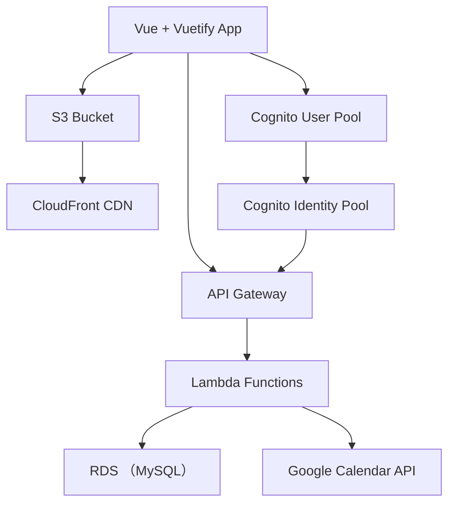

# AWS構成図

```mermaid
graph TD
  A[Vue + Vuetify App]
  B[S3 Bucket]
  C[CloudFront CDN]
  D[Cognito User Pool]
  E[Cognito Identity Pool]
  F[API Gateway]
  G[Lambda Functions]
  H[RDS （MySQL）]
  I[Google Calendar API]

  A --> B
  B --> C
  A --> D
  D --> E
  A --> F
  E --> F
  F --> G
  G --> H
  G --> I
```
