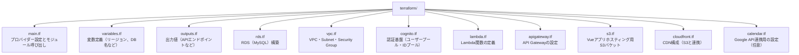

# Terraform構成

以下は、Terraformを使用してインフラをコード化する際のディレクトリ構成例です。各ファイルは特定のリソースや設定を担当し、全体としてアプリケーションのインフラを定義します。

```mermaid
graph TD
  A[terraform/]
  A --> B[main.tf<br>プロバイダー設定とモジュール呼び出し]
  A --> C[variables.tf<br>変数定義（リージョン、DB名など）]
  A --> D[outputs.tf<br>出力値（APIエンドポイントなど）]
  A --> E[rds.tf<br>RDS（MySQL）構築]
  A --> F[vpc.tf<br>VPC・Subnet・Security Group]
  A --> G[cognito.tf<br>認証基盤（ユーザープール・IDプール）]
  A --> H[lambda.tf<br>Lambda関数の定義]
  A --> I[apigateway.tf<br>API Gatewayの設定]
  A --> J[s3.tf<br>Vueアプリホスティング用S3バケット]
  A --> K[cloudfront.tf<br>CDN構成（S3と連携）]
  A --> L[calendar.tf<br>Google API連携用の設定（任意）]
```
